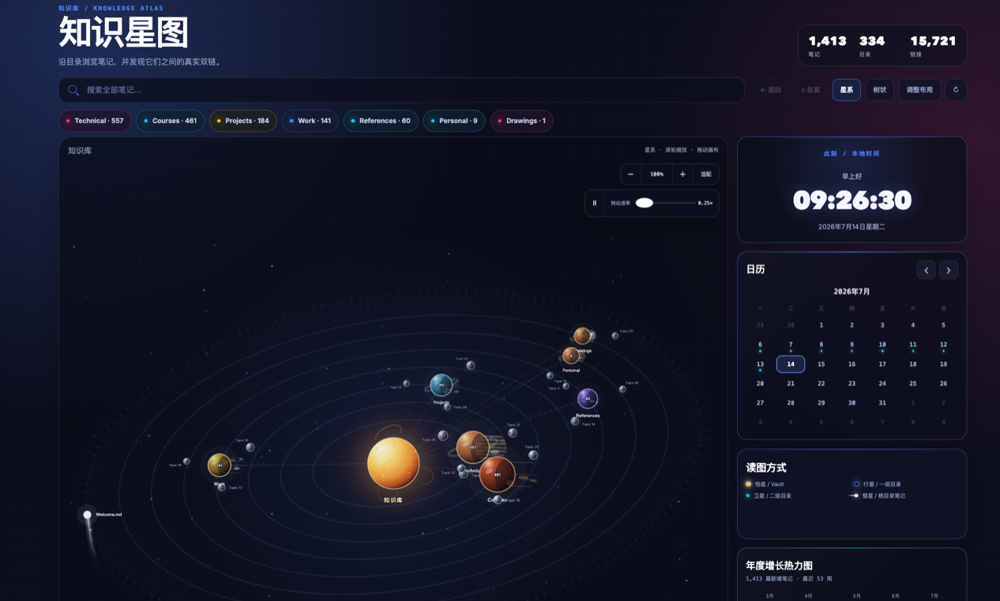
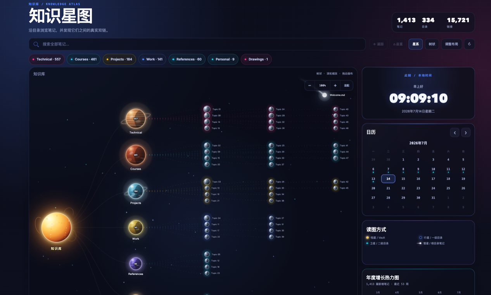

<div align="center">

# Knowledge Atlas

**Turn your Obsidian vault into a living, interactive knowledge galaxy.**

[](releases/knowledge-atlas-1.11.2.zip)
[](https://obsidian.md/)
[](LICENSE)
[](#privacy)

**English** · [简体中文](README.zh-CN.md)

</div>

Knowledge Atlas is a visual navigation and review plugin for [Obsidian](https://obsidian.md/). It reads Markdown files through Obsidian's native API and presents the vault as an animated galaxy, a structured tree, and a set of activity and knowledge-health panels. It does not require Dataview, generated index notes, or a network service.

> **Availability:** the plugin is currently installed manually. It has not yet been listed in Obsidian's Community Plugins directory.

## Screenshots

### Galaxy overview



### Tree view



The screenshots use anonymized labels. Knowledge Atlas never changes note names to render the atlas.

## Highlights

| Area | What it provides |
|---|---|
| Galaxy navigation | The vault is a star, top-level folders are planets, and second-level folders are moons. Node size reflects the amount of knowledge below it. |
| Celestial motion | Mercury-to-Neptune period references with perceptual time compression, smooth revolution and self-rotation, adjustable speed, hover-to-pause inspection, atmospheric shading, rings, and a soft solar corona. |
| Root-note comet | One root-level Markdown note becomes a comet. The selection is stable during the day and can rotate on another day; no special filename is required. |
| Focused satellites | The overview shows at most three representative second-level folders per planet on one readable moon track; drill down to see the rest. |
| Tree and drill-down views | Switch to a readable hierarchy, enter folders, inspect note nodes, and follow real links resolved by Obsidian. |
| Search and recency | Search the full vault, open notes directly, and browse recently updated notes. |
| Activity insights | A conventional 53-week heatmap, 12-month growth trajectory, weekday rhythm, local clock, and activity-aware calendar. |
| Knowledge health | Find orphan notes, unresolved links, and notes that have not been updated for a configurable period. |
| Review workflow | Open every note created on a heatmap day and receive a stable daily review of three older notes. |
| Flexible workspace | Drag and resize the canvas and panels, save the layout, reset it, zoom, pan, and fit the graph to the viewport. |
| Internationalization | Chinese and English interfaces, selected from the plugin settings. |

## How the galaxy is organized

```text
Vault                         → star
├── Top-level folder          → planet
│   ├── Second-level folder   → moon
│   └── Notes and subfolders  → influence celestial size
└── Root-level Markdown note  → daily stable comet selection
```

The overview intentionally stops at the second folder level so a large vault remains readable. Enter a folder or use search to reach deeper folders and individual notes.

## Installation

### Install the packaged version

1. Download [`knowledge-atlas-1.11.2.zip`](releases/knowledge-atlas-1.11.2.zip).
2. Extract it. The archive contains a folder named `knowledge-atlas`.
3. Copy that folder into your vault:

   ```text
   <your-vault>/.obsidian/plugins/knowledge-atlas/
   ```

4. In Obsidian, open **Settings → Community plugins**.
5. Select **Reload installed plugins** if Knowledge Atlas is not shown, then enable **Knowledge Atlas**.

### Build from source

Clone the repository, then build the release file:

```bash
npm install
npm run build
```

Create `<your-vault>/.obsidian/plugins/knowledge-atlas/` and copy these generated/runtime files into it:

```text
main.js
manifest.json
styles.css
```

`versions.json`, `README.md`, and `LICENSE` are useful for distribution but are not required at runtime.

## Open and use the atlas

- Select the Knowledge Atlas ribbon icon.
- Or run **Knowledge Atlas: Open atlas** from the command palette.
- Select a planet or moon to drill into a folder.
- Select a note node, search result, heatmap day, health result, or review card to open the corresponding note.

### Canvas controls

| Control | Action |
|---|---|
| Mouse wheel | Zoom in or out |
| Drag empty canvas | Pan the graph |
| `−` / `+` | Adjust zoom |
| Fit | Fit the current graph to the canvas |
| Play / pause | Start or stop celestial motion |
| Speed slider | Set motion from `0.25×` to `3×` |
| Hover a celestial body | Pause the system for inspection |
| Galaxy / Tree | Switch between orbital and hierarchical layouts |
| Arrange layout | Move and resize the canvas and dashboard panels |

## Settings

- **Excluded folders** — comma-separated vault paths or prefixes that should not appear in the atlas.
- **Maximum folders** — maximum folder nodes rendered in one view.
- **Maximum notes** — maximum note nodes rendered in one view.
- **Recent notes** — number of recently modified notes shown in the panel.
- **Open notes in a new tab** — keep the atlas open when navigating to a note.
- **Interface language** — follow the system language or use Chinese/English.
- **Open Atlas on startup** — open Knowledge Atlas when the Obsidian workspace loads.
- **Stale note threshold** — number of inactive days before a note is considered stale.

Custom panel positions, sizes, stacking order, and motion speed are saved in the plugin settings. Compact screens automatically fall back to a responsive layout.

## Dates and activity data

Knowledge Atlas prefers a note's `created`, `created_at`, or `date-created` frontmatter value. When those properties are unavailable, it falls back to the file creation time reported by Obsidian. Frontmatter is therefore optional.

Heatmaps and trajectories follow the conventional chronological direction: older activity is on the left and newer activity is on the right.

## Performance and accessibility

- Celestial positions update with `requestAnimationFrame`; more expensive link geometry and surface work run on lighter schedules.
- Blur and shadow effects are reduced while the system is moving and restored when paused or hovered.
- Tree mode pauses orbital animation automatically.
- The operating system's reduced-motion preference disables automatic animation.
- The plugin supports desktop and mobile according to the manifest, while the full free-layout experience is most comfortable on larger screens.

## Privacy

Knowledge Atlas runs locally inside Obsidian. It does not upload vault content, call external APIs, create generated index notes, or require a third-party database. Search, links, activity, and health checks are derived from Obsidian's local vault and metadata cache.

## Development and releases

The readable source is in `src/main.js`. The production bundle is generated with esbuild and is attached to GitHub Releases rather than tracked in the repository.

Before publishing a version to GitHub Releases or submitting it to the Obsidian Community Plugins directory:

1. Update `version` in `manifest.json`.
2. Add the version mapping to `versions.json`.
3. Run `npm run lint` and `npm run build`.
4. Verify the generated bundle with `node --check main.js`.
5. Test the plugin in Obsidian and check developer errors.
6. Create a GitHub release whose tag exactly matches the manifest version.
7. Attach `main.js`, `manifest.json`, and `styles.css` to the release.

## Contributing

Issues and focused pull requests are welcome. When reporting a visual or performance issue, include the Obsidian version, operating system, approximate vault size, layout mode, and a screenshot with private note names removed.

## License

[MIT](LICENSE) © 2026 Eason38467
